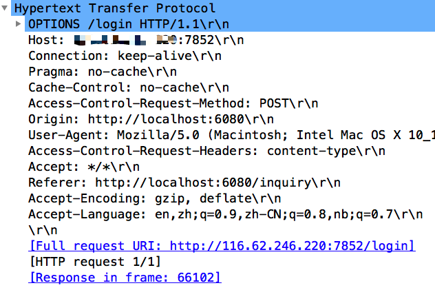
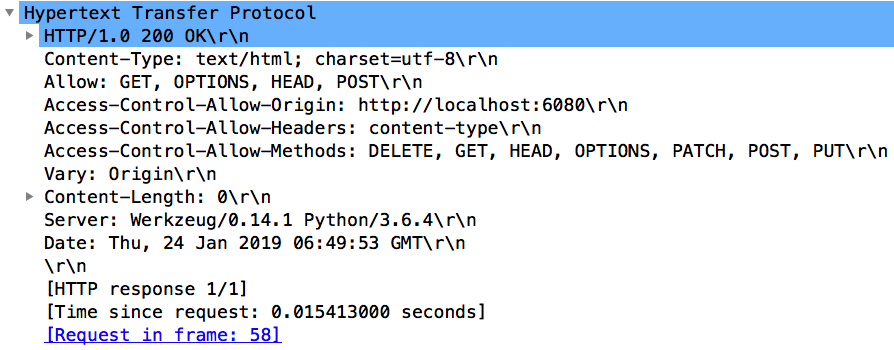
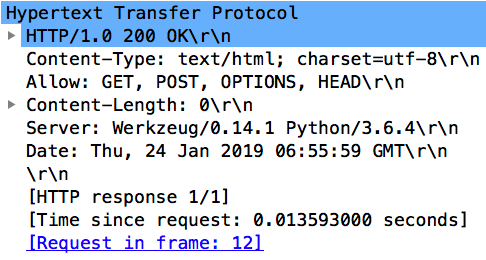
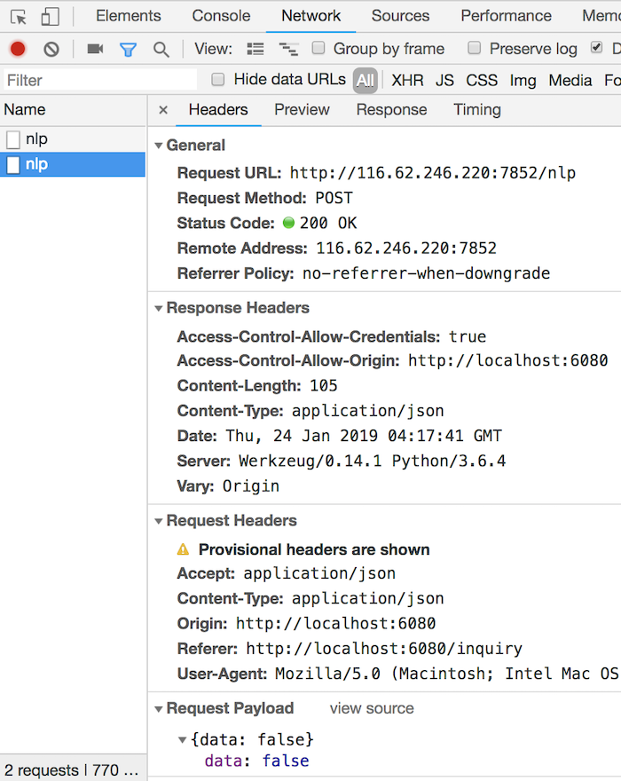
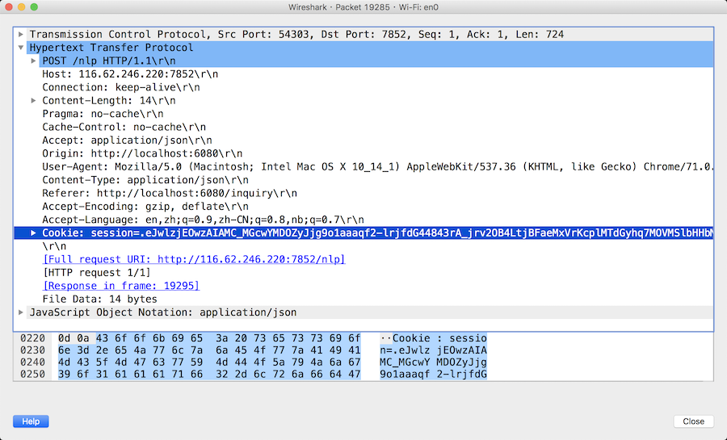

跨域一直 Web 开发绕不开的问题，尤其是当下前后端分离开发，微服务盛行，甚至在 Web3.0 时代前端直接向区块链发起请求。解决这个问题并不麻烦，很多 Web 框架都有现成的 CORS 库开箱即用。但如果你有兴趣了解一下跨域问题的由来，跨域背后的原理，请往下看吧。

## 常见跨域的现象

首先从问题入手，在前端向当前页面不同端口的服务使用 AJAX 发送请求时，常常会遇到类似以下错误：

1. Access to fetch at 'http://test.com/login' from origin 'http://localhost:6080' has been blocked by CORS policy: Response to preflight request doesn't pass access control check: No 'Access-Control-Allow-Origin' header is present on the requested resource. If an opaque response serves your needs, set the request's mode to 'no-cors' to fetch the resource with CORS disabled.
2. Access to fetch at 'http://test.com/login' from origin 'http://localhost:6080' has been blocked by CORS policy: Response to preflight request doesn't pass access control check: The value of the 'Access-Control-Allow-Credentials' header in the response is '' which must be 'true' when the request's credentials mode is 'include'.

有经验的童鞋一定就能看出，跨域了。一般来说，如果是开发阶段，前端会设置一下 `package.json` 的 `proxy` 转发请求；如果请求的资源在多个服务端，就让服务端的小伙伴就开个门，引个 CORS 的包解决；亦或是要搞 DAPP 开发，往同步节点的配置文件里设置一下 Header 允许跨域访问。分分钟解决了，但你可能会问：是什么让你的请求”跨域“了？是浏览器吗？是请求之前拦截的，还是拿到了数据再拦截的呢？首先引入本文的第一个角色：同源政策。

## 同源政策

### 起源

1995年，同源政策由 Netscape 公司引入浏览器。目前，所有浏览器都实行这个政策。

最初，它的含义是指，A网页设置的 Cookie，B网页不能打开，除非这两个网页"同源"。所谓"同源"指的是"三个相同"。

- 协议相同
- 域名相同
- 端口相同

### 目的

同源政策的目的，是为了保证用户信息的安全，防止恶意的网站窃取数据。

设想这样一种情况：A网站是一家银行，用户登录以后，又去浏览其他网站。如果其他网站可以读取A网站的 Cookie，会发生什么？

很显然，如果 Cookie 包含隐私（比如存款总额），这些信息就会泄漏。更可怕的是，Cookie 往往用来保存用户的登录状态，如果用户没有退出登录，其他网站就可以冒充用户，为所欲为。因为浏览器同时还规定，提交表单不受同源政策的限制。

由此可见，"同源政策"是必需的，否则 Cookie 可以共享，互联网就毫无安全可言了。

### 限制范围

随着互联网的发展，"同源政策"越来越严格。目前，如果非同源，共有三种行为受到限制。

> （1） Cookie、LocalStorage 和 IndexDB 无法读取。
>
> （2） DOM 无法获得。
>
> （3） AJAX 请求不能发送。

（以上摘自阮一峰文章 [浏览器同源政策及其规避方法](http://www.ruanyifeng.com/blog/2016/04/same-origin-policy.html)）

那么也就是说，如果服务端不做任何设置，浏览器为了用户的安全，防止 Cookie 被恶意网站使用，会发出跨域警告，阻止继续请求。那么跨域问题如何解决呢？在给出解决方案前，其实还有一点需要介绍，我们通常会发现跨域请求有时会伴随一个 OPTIONS 请求，这个请求是用来做什么的？

## OPTIONS 预检请求 

跨域请求实际上分为两类：**简单请求**（simple request）和 **非简单请求**（not-simple-request）。目前常用的 JSON 格式所需要的 Header：application/json 便属于非简单请求。

对于非简单请求，在正式跨域之前，浏览器会根据需要发起一次**预检**（也就是 OPTIONS 请求），用来让服务端返回允许的方法（如 GET、POST），被跨域访问的 Origin（来源或者域），还有是否需要 Credentials (认证信息)等。（详见阮一峰 [跨域资源共享 CORS 详解](http://www.ruanyifeng.com/blog/2016/04/cors.html)）

WireShark 抓包 OPTIONS 请求如下：



OPTIONS 请求可以被称作一次嗅探请求，通过这个方法，客户端可以在采取具体的资源请求之前，决定对资源采取何种必要措施。 如果预检请求发送后服务端没有对跨域做相应的配置，那么真实的跨域请求时不会发出的。如果服务端对跨域进行了相应的配置，如允许客户端所请求的 HTTP method 或 header，那么浏览器就会进行第二次真实的跨域请求，获取资源。

若服务端进行了跨域的相关配置，允许客户端进行跨域请求，抓包如下：



可以看到服务到返回了 Access-Control-Allow-Origin, Access-Control-Allow-Methods, Access-Control-Allow-Headers 等字段，用于告知浏览器该服务端允许的 域名，请求方式 及 HTTP 报文的 Headers。

若服务端没有进行跨域相关配置，那么响应通常长这样：



这样，浏览器知道该请求未得到服务端的授权，也就不会再发第二个跨域请求了。由此可见，并不是浏览器拿到了服务端的资源不展示而已，而是浏览器通过预检请求得知服务端没有给前端"开门"，就不再浪费资源继续请求了。

## 跨域的常见 4 种解决方案

跨域的解决方案很多，据我了解大致 4 种，但目前主流的有 通过设置与 CORS 相关的 Headers 来允许跨域请求 以及 通过服务端代理发送请求。

### 利用 script 标签发送 JSONP 请求 

通常一个 html 页面上会包含大量的 JS 脚本，客户端在拿到 html 页面解析后会向这些 script 中的 `src` 发起 GET 请求这些资源。但这些脚本可能是服务器上的，也可能是 CDN 的，也就是说浏览器在用 GET 请求访问 script 标签时是不受同源策略控制的。（其实带有 `src` 属性的标签都不会受到同源策略的限制，如 `<\script>`、`<\img>`、`<\iframe>` ）JSONP 的方案正是基于这一点。我们可以将跨域的请求伪装为一个脚本请求，将需要调用的路由函数名称写在 src 的 url 里，类似 `www.bbb.com/123?callback=xxx`。

#### 具体实现

在远程服务端 `server.com` ，提供 `remote.js`文件访问，路由为 `/remote.js`，内容如下：

```
alert('我是远程文件');
```

在客户端 `client.com` 的 html 中，有如下代码：

```html
<!DOCTYPE html>
<html>
<head>
    <meta charset="utf-8" />
    <meta http-equiv="X-UA-Compatible" content="IE=edge">
    <title>Client</title>
    <meta name="viewport" content="width=device-width, initial-scale=1">
    <link rel="stylesheet" type="text/css" media="screen" href="main.css" />
    <script type="text/javascript" src="http://server.com/remote.js"></script>
</head>
<body>
    Client
</body>
</html>
```

页面便会弹出提示框，调用成功。这只是简单的 `alert`，如果要像正常的请求一样调用 API，拿到数据后用 callback 处理，怎么实现呢？

可以将callback的名称和参数写到 `remote.js` 中，这样 callback 就会和 `alert` 一样被执行。比如将 `remote.js` 修改如下：

```javascript
doSomething({
	"param1": "123",
	"param2": "456"
});
```

客户端 html 修改如下：

```html
<!DOCTYPE html>
<html>
<head>
    <meta charset="utf-8" />
    <meta http-equiv="X-UA-Compatible" content="IE=edge">
    <title>Client</title>
    <meta name="viewport" content="width=device-width, initial-scale=1">
    <link rel="stylesheet" type="text/css" media="screen" href="main.css" />
    <script type="text/javascript" src="http://server.com/remote.js"></script>
</head>
<body>
    Client
</body>
</html>

<script>
    function doSomething(obj) {
        let { param1, param2 } = obj;
        console.log('param1: ', param1);
        console.log('param2: ', param2);
    }
</script>
```

但是问题来了，上面的 script 标签是写死的，服务端 `remote.js` 里的函数名称是写死的，通常我们不太可能在客户端写死这样一个 script 标签，并在服务端提前为每个 API 生成一份 JS 文件，所以，需要再客户端动态生成 `script` 标签，在 `src` 的 url 中告诉服务端需要调用的函数名称，如：`http://server.com/remote.js?callback=doSomething`，客户端可以参考如下修改：

```html
<!DOCTYPE html>
<html>

<head>
    <meta charset="utf-8" />
    <meta http-equiv="X-UA-Compatible" content="IE=edge">
    <title>Client</title>
    <meta name="viewport" content="width=device-width, initial-scale=1">
    <link rel="stylesheet" type="text/css" media="screen" href="main.css" />
    <!-- <script type="text/javascript" src="http://server.com/remote.js"></script> -->
</head>

<body>
    Client
</body>

</html>

<script>

</script>

<script type="text/javascript">
    function doSomething(obj) {
        let { param1, param2 } = obj;
        console.log('param1: ', param1);
        console.log('param2: ', param2);
    }

    var url = "http://server.com/remote.js?callback=doSomething";
    var script = document.createElement('script');
    script.setAttribute('src', url);
    document.getElementsByTagName('head')[0].appendChild(script); 
</script>
```

然后服务端拿到请求后动态生成 JS 文件返回。

但这，这种方案缺点也很明显，只支持 GET 请求。

### 利用 domcument.domain 实现跨域

这个方案简单粗暴，既然所访问的域名和当前页面不一样，那么用 JS 把当前的 domain 改成一样的不就完了！

但可想而知，这样的方案一定是有限制的，否则客户端要访问那个域名下的服务，就把 domain 随意修改了，那么同源策略岂不是没什么用了。这个限制就是当前页面的域名和需要强行设置的一级域名相同才行，比如：

1. `www.sojson.com`  下指到 `sojson.com` 是可以的。

2. `icp.sojson.com`  下指到 `sojson.com` 是可以的。

### 服务端设置与 CORS 相关的 Headers

如果你要调用的是自家服务，那相对来说要好办的多，只要服务端额外做些配置，就可以允许跨域请求。

与 CORS 相关的有如下 5 个 Headers：

1. Access-Control-Allow-Origin

   该字段是必须的。它的值要么是请求时 `Origin` 字段的值，要么是一个 `*`，表示接受任意域名的请求。

2. Access-Control-Allow-Credentials

   该字段可选。它的值是一个布尔值，表示是否允许发送 Cookie。默认情况下，Cookie 不包括在 CORS 请求之中。设为 `true`，即表示服务器明确许可，Cookie可以包含在请求中，一起发给服务器。这个值也只能设为 `true`，如果服务器不要浏览器发送Cookie，删除该字段即可。

3. Access-Control-Expose-Headers

   该字段可选。CORS 请求时，`XMLHttpRequest` 对象的 `getResponseHeader()` 方法只能拿到6个基本字段：`Cache-Control`、`Content-Language`、`Content-Type`、`Expires`、`Last-Modified`、`Pragma`。如果想拿到其他字段，就必须在`Access-Control-Expose-Headers` 里面指定。上面的例子指定，`getResponseHeader('FooBar')`可以返回`FooBar`字段的值。

4. Access-Control-Allow-Headers

   用于 [preflight request](https://developer.mozilla.org/en-US/docs/Glossary/preflight_request) （预检请求）中，列出了将会在正式请求的 [`Access-Control-Expose-Headers`](https://developer.mozilla.org/zh-CN/docs/Web/HTTP/Headers/Access-Control-Expose-Headers) 字段中出现的首部信息。

   简单首部，如 [`simple headers`](https://developer.mozilla.org/en-US/docs/Glossary/simple_header)、[`Accept`](https://developer.mozilla.org/zh-CN/docs/Web/HTTP/Headers/Accept)、[`Accept-Language`](https://developer.mozilla.org/zh-CN/docs/Web/HTTP/Headers/Accept-Language)、[`Content-Language`](https://developer.mozilla.org/zh-CN/docs/Web/HTTP/Headers/Content-Language)、[`Content-Type`](https://developer.mozilla.org/zh-CN/docs/Web/HTTP/Headers/Content-Type) （只限于解析后的值为 `application/x-www-form-urlencoded、 multipart/form-data` 或 `text/plain` 三种MIME类型（不包括参数）），它们始终是被支持的，不需要在这个首部特意列出。

5. Access-Control-Max-Age

   表示 [`preflight request`](https://developer.mozilla.org/en-US/docs/Glossary/preflight_request)（预检请求）的返回结果（即  [`Access-Control-Allow-Methods`](https://developer.mozilla.org/zh-CN/docs/Web/HTTP/Headers/Access-Control-Allow-Methods)  和 [`Access-Control-Allow-Headers`](https://developer.mozilla.org/zh-CN/docs/Web/HTTP/Headers/Access-Control-Allow-Headers)  提供的信息） 可以被缓存多久，单位为秒。

#### 跨域附带 Cookie

需要注意的一点是，在默认情况下，浏览器的 [fetch API](https://developer.mozilla.org/zh-CN/docs/Web/API/Fetch_API/Using_Fetch) 默认是不会带上跨域的 Cookie 的，需要设置 `credentials: 'include'`，浏览器才会将跨域的 Cookie 带上。否则，即使服务端设置了 `Access-Control-Allow-Credentials`，给了客户端权限，但客户端请求的时候没有带上这个权限的凭证，与未认证就没有什么区别了。

另外一种情况是，客户端设置了 `credentials: 'include'`，但服务端并未允许发送 Cookie，没有设置 `Access-Control-Allow-Credentials` 为 `ture`，这样浏览器会报错：

```
Response to preflight request doesn't pass access control check: The value of 
the 'Access-Control-Allow-Credentials' header in the response is '' which must
be 'true' when the request's credentials mode is 'include'.
```

也就是文章开头的第二个错误。

### 服务端代理发送请求

上一个方案很方便，但问题是，如果调用的是别人家的服务，总不能让别人去专门给你设置几个 Header 吧？既然改不了别人的后端，那不如自己搞个后端解决。

因为，同源策略是用来限制浏览器的，非浏览器环境是没有这个限制的。那么可以起个代理服务，专门用来接收这种请求，然后由这个服务转发请求，把数据拿到再返回前端，不就彻底绕过同源策略了吗？其实在用一些主流前端框架开发时， `package.json` 中设置的 `proxy` 字段就是干这事的，配置后开发服务器会帮你做请求转发。

当然这是开发环境，在生产环境，用 nginx 配置代理可能是更合适的选择。

## 坑

1. 在发送跨域请求时，Chrome 的 devTools 里的 Network 不会显示跨域附带的 Cookie

   

   但用 WireShark 抓包，是可以看到附带了 Cookie 的。

   


## 参考

1. http://www.ruanyifeng.com/blog/2016/04/same-origin-policy.html
2. http://www.ruanyifeng.com/blog/2016/04/cors.html
3. https://www.jianshu.com/p/5cf82f092201
4. https://blog.csdn.net/hansexploration/article/details/80314948